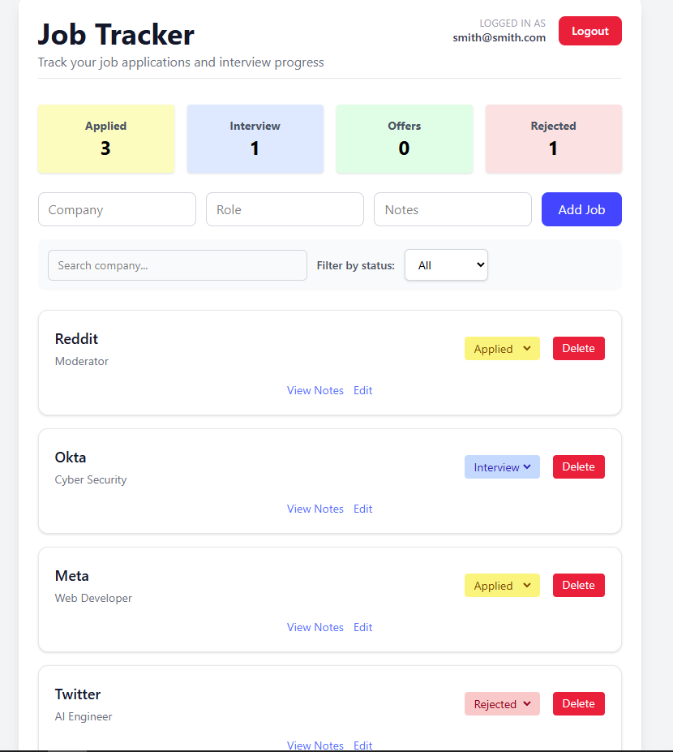
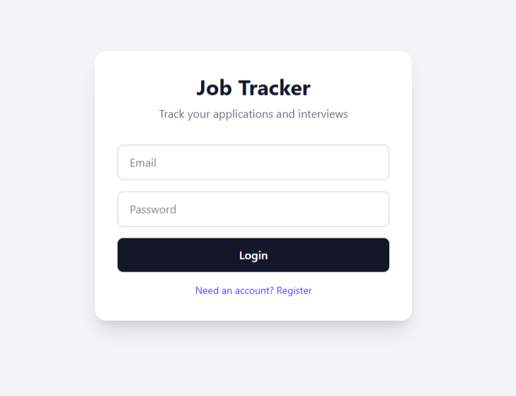
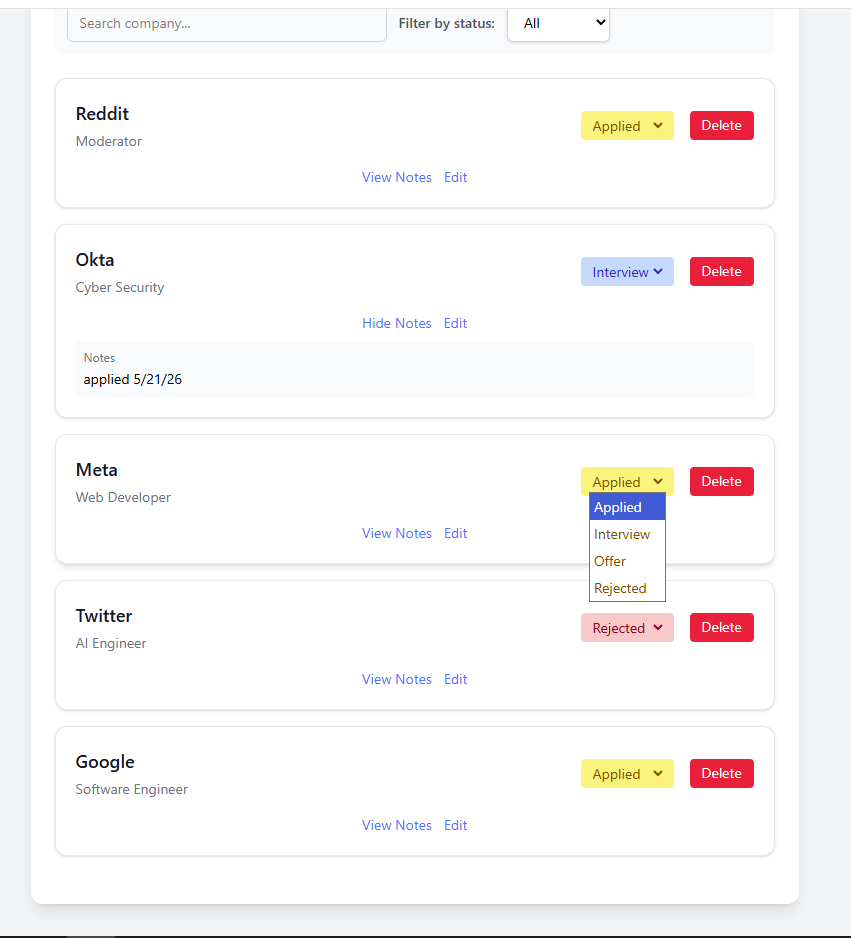
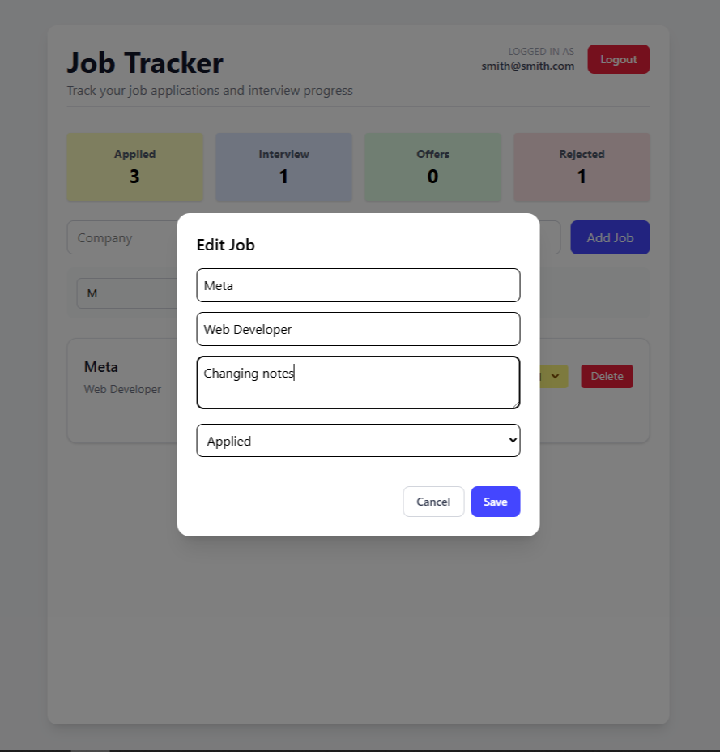
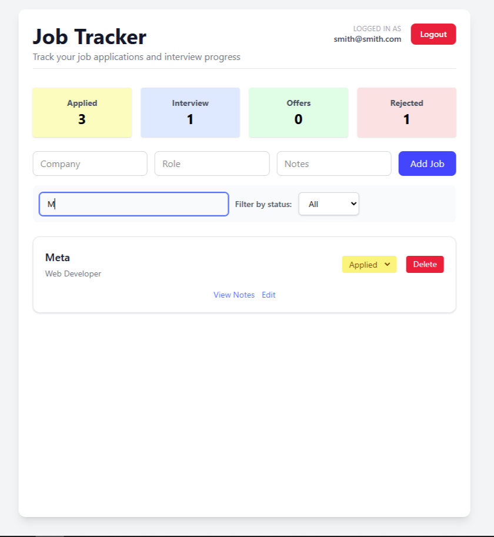

# Job Tracker

A full-stack job application tracking app built with React, TypeScript, Express, and PostgreSQL.

## Users Can

- Register and log in securely with JWT authentication
- Create, edit, update, and delete job applications
- Filter and search applications
- Track application statuses including Applied, Interview, Offer, and Rejected

---

## Tech Stack

### Frontend

- React
- TypeScript
- Tailwind CSS
- React Hot Toast

### Backend

- Node.js
- Express
- PostgreSQL
- JWT Authentication
- bcrypt

---

## Features

- User authentication and protected routes
- Persistent PostgreSQL database
- Full CRUD functionality
- Status tracking
- Search and filtering

---

## Screenshots

### Dashboard



### Login page



### Features - Notes & Status



### Edit Modal



### Search & Filter



---

## Installation

### Clone Repository

```bash
git clone <repo-url>
cd job-tracker
```

---

## Backend Setup

```bash
cd server
npm install
```

Create a `.env` file:

```env
DATABASE_URL=your_database_url
JWT_SECRET=your_secret
PORT=5000
```

Run backend:

```bash
npm run dev
```

---

## Frontend Setup

```bash
cd client
npm install
```

Create a `.env` file:

```env
VITE_API_URL=http://localhost:5000
```

Run frontend:

```bash
npm run dev
```

---

## Future Improvements

- Drag-and-drop application stages
- Email reminders
- Resume uploads
- Interview scheduling
